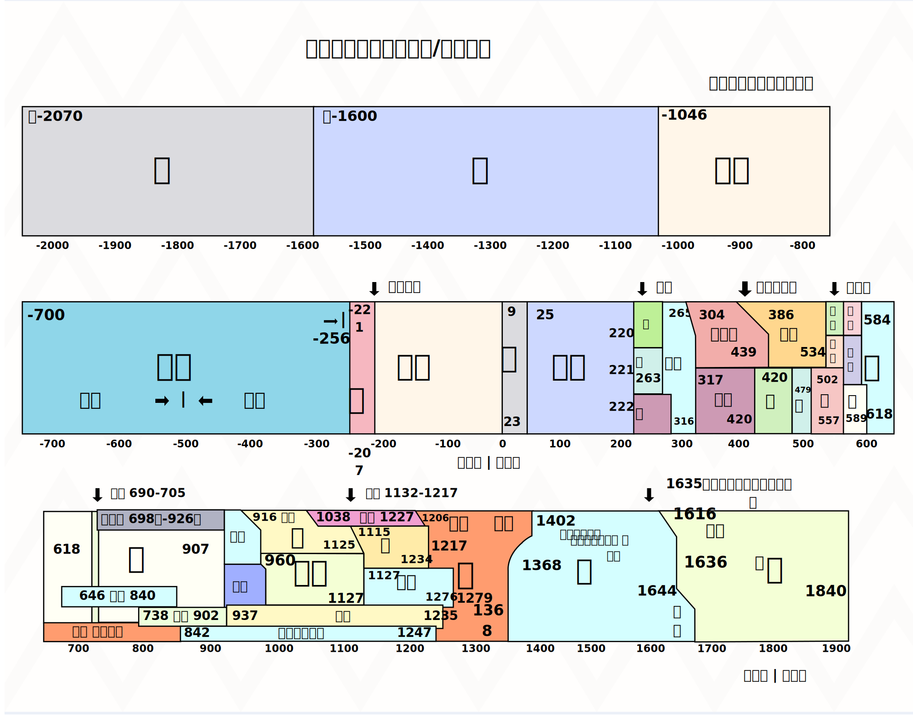
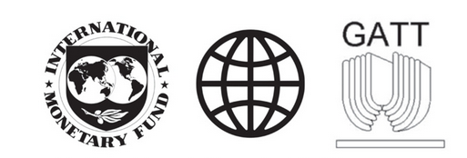

# 历史学考复习

## 中国古代民族关系：大一统中央政府设立的边疆的管理民族地区的机构

| 朝代  | 机构          | 皇帝、时间    | 民族、地区   | 内容                               | 页码  |
|:---:|:-----------:|:--------:|:-------:|:-------------------------------- |:---:|
| 西汉  | 西域都护府       | 汉宣帝BC60年 | 西域乌垒城   | 作为管理西域的军政机构，还在西域设立武威、张掖、酒泉、敦煌四郡。 | 23  |
| 唐朝  | 安西都护府、北庭都护府 | 唐太宗640年  | 西域      | 统辖天山南北                           | 36  |
| 元朝  | 宣政院         |          | 吐蕃地区藏族  | 管理                               | 62  |
| 元朝  | 北庭都元帅府、宣慰司  |          | 西域      | 管理军政事务，加强了对西域的管辖                 | 62  |
| 元朝  | 澎湖巡检司       |          | 台湾      | 行政管理职能以经略台湾                      | 62  |
| 明朝  | 行都指挥使司      |          | 西藏（乌思藏） | 管理西藏军民事务，任用藏族上层人士                | 80  |
| 明朝  | 奴儿干都司       | 明朝前期     | 女真、东北   | 对东北女真各部落首领封授官号                   | 80  |
| 清朝  | 驻藏大臣        | 1727开始   | 西藏      | 中央派遣，代表朝廷与达赖班禅共同治理西藏             | 84  |
| 清朝  | 理藩院         |          | 蒙古族、藏族  | 掌管民族事务                           | 84  |
| 清朝  | 盟、旗两级单位     |          | 蒙古族     | 任命蒙古王公为盟长、旗长                     | 84  |
| 清朝  | 伊犁将军        | 1762     | 新疆      | 总领军政事务                           | 84  |

## 书上没有细说的机构

| 朝代  | 机构          | 皇帝、时间   | 民族、地区  | 内容  | 页码  |
|:---:|:-----------:|:-------:|:------:|:--- |:---:|
| 唐朝  | 安北都护府、瀚海都督府 |         | 回纥蒙古地带 |     | 37  |
| 唐朝  | 渤海都督府、黑水都督府 | 713、726 | 靺鞨、东北  |     | 37  |
| 唐朝  | 安东都护府       |         | 朝鲜     |     | 37  |

## 中国古代政治措施

1. **秦朝** 秦始皇    
    政治制度：  
    确立**皇帝制**与皇帝至高无上的地位  
    中央设置**三公九卿制**组成中央政府：  
      三公：丞相、太尉、御史大夫  
      九卿泛指分掌具体事物的诸卿(qing1)  
    在地方彻底废除分封制，将**郡县制**在全国推广，设立郡县两级行政机构，主要官员由中央任免和考核。  
    县以下设置**乡、里、亭**，分别负责管理民众和治安  
    其他方面：  
   **统一车轨文字度量衡**   
   修 **驰道、直道**  
    颁行**法律**，编制户籍  
    **迁徙**六国豪强**贵族**到关中、巴蜀等地  
   **整顿社会风俗**   

2. **西汉** 汉武帝  
    政治：  
    颁行**推恩令**，削弱诸侯王势力  
    加强皇权，削弱丞相权力，设立直接为皇帝所掌控的**中朝**，尚书令的作用开始提升  
    确立以**察举制**为代表的新的官吏选拔制度  
    将全国划分为13州部，分设**刺史**，负责对辖区内军机官员及子弟和豪强势力进行巡视监察  
    任用**酷吏**治理地方，严厉打击豪强、游侠不法行为  
    经济：  
    改革币制，将**铸币权收归中央**  
    **盐铁官营**   
    **均输平准**（国家调控）  
    抑制工商业者征收财产税  
    罢黜百家，独尊**儒**术  
    民族关系：  
    开拓疆域：
      卫青霍去病打匈奴  
      河西走廊设置武威、张掖、酒泉、敦煌四郡  
      张骞通西域  
      丝绸之路  
      BC60 设置西域都护府  

3. **唐朝**  
    选官制度：产生**科举制**  
    **三省六部**制：  
    **中书省**负责草拟诏令  
    **门下省**负责审核诏令  
    **尚书省**负责执行诏令，下设六部
    宰相议事的地方称**政事堂**，改成中书门下，提高了行政效率三省出现一体化趋势  
    赋税制度：租庸调制改为**两税法**：780年，皇帝唐德宗，宰相杨炎  

4. **宋朝** 宋太祖  
    加强对地方的控制：  
    派文官出任各地方长官知州，节度使变为虚衔  
    设著录转运司统管地方财政  
    地方精锐编入禁军，拱卫京师，镇守地方，定期更换驻地  
    分散地方权力：  
    在中央，枢密院转账军政，三司专掌财政，与宰相分权，增设参知政事为副相  
    枢密院与禁军管理机构“三衙”分权  
    在地方，包括转运司在内，先后设立了平行的四个路级机构，从不同方面对各州进行监控和节制  
    州一级增设**通判**，与知州共同签署文书，彼此制约  
    为抑制武将势力膨胀，**崇文抑武**：  
    罢免宿将兵权，**文官**担任枢密院长官  
    提高科举规模，抬高**文官**和士人的地位  

5. 明朝 
    朱元璋废除宰相制度
    明成祖设立内阁

6. 清朝
    设立奏折制度
    设立军机处

## 中国古代朝代图

## 重要历史事件的大概时间（世界古代史、近代史、中国近代史）

1. 公元**前几千年**  
    古代西亚两河流域、埃及、印度产生文明  

2. 公元**前1千年以内**  
    希腊：古代希腊城邦逐渐发展起来（公元前8-前6世纪）  
    西亚：公元**前8世纪**之后的亚述；公元**前6世纪**，**波斯**兴起于伊朗高原，征服了广大地区  
    希腊：公元**前4世纪晚期**，马其顿的**亚历山大帝国**建立  
    罗马：罗马共和国（前509～前27年）、**罗马帝国**的建立（**前27**～476年/1453年）  

3. 公元**前5世纪以内**  
    宗教：**1世纪**，基督教诞生于巴基斯坦  
    中国和罗马的接触：2世纪，已经有来自罗马的商人到达洛阳  
    **4世纪末**，罗马帝国分裂  
    **5世纪后期**，西罗马帝国灭亡  

4. **欧洲中世纪时期**（**5世纪到15世纪**）  
    **6世纪**查士丁尼在位时，拜占庭扩张  
    **9世纪**，**基辅罗斯**建立，**13世纪上半期**，被蒙古征服  
    **城市**的兴起：**10-11世纪**起，西欧  
    英国议会的起源：**1215年**签署的《大宪章》调整了封君和封臣的关系，有利于封建统治的稳定  
    **15世纪中期**，拜占庭灭亡  
    **15世纪晚期**，英格兰都铎王朝建立（王权得到巩固）；法兰西基本统一；伊比利亚半岛形成了西班牙和葡萄牙  
    **16世纪初**，以莫斯科公国为中心的统一国家建立并扩张，1547，伊凡四世沙皇加冕，**17世纪末**，俄罗斯成为地跨两洲的大帝国  
    ***同时期的亚洲***  
    **646年**，日本**大化改新**  
    **7世纪初**，穆罕默德创立**伊斯兰教**  
    **7世纪末**，新罗初步统一了朝鲜半岛，建立中央集权  
    **8世纪中期**，**阿拉伯**建立起地跨亚欧非三洲的大帝国  
    **12世纪末**，日本建立第一个幕府：镰仓幕府  
    **13世纪**奥斯曼发展，**14世纪中期**，向欧洲进军，**1453**，灭拜占庭，**16世纪后期**，建立起地跨三洲的大帝国  
    **17世纪**，日本建立德川幕府，闭关锁国  

5. **大航海时代**（**15-16世纪**）  时间顺序：**葡西葡西，迪哥达麦**  
    **1487-1488年**，迪亚士航海（到达好望角）  
    **1492**，哥伦布航海到达美洲的巴哈马群岛  
    **1497-1498年**，达.伽马绕过好望角到达印度  
    **1519-1522年**，麦哲伦船队环球航行  
    **1571**，马尼拉大帆船航线开通  
    **16世纪**，葡萄牙把巴西变成殖民地，在非洲、印度、中国澳门等地设置殖民据点和商站  
    **17世纪**，荷兰、英国、法国也在亚洲、非洲、北美建立了多个殖民地  

6. 文艺复兴、宗教改革、科学革命与启蒙运动
    **14-17世纪初** 欧洲文艺复兴  
    **1517开始** 宗教改革, 1517年《九十五条论纲》  
    **16-17世纪** 科学革命  
    **17-19世纪** 启蒙运动  

7. **资产阶级革命、资本主义的扩展**（**17世纪起**）  
    ***资产阶级革命***  
    **1640年**英国革命，1644马斯顿荒原战役，**1688年**英国发生“光荣革命”  
    **1775年**莱克星顿的枪声，**1781年**美国军队打败了英国军队，**1783年**英国承认美国独立，**1787年**制订宪法  
    **1789年**法国攻占巴士底狱，8月，颁布《人权宣言》，**1791年**颁布宪法，**1799年**，拿破仑建立军事独裁统治，**1804年**，颁布《法国民法典》  
    ***资本主义的扩展***（**19世纪**）  
    **1861年**，俄国的农奴制改革  
    **1861年-1865年**，美国南北战争  
    **1861年**，意大利王国建立，**1870年**，国家统一  
    **1871年**，德意志帝国成立，颁布宪法  
    **1868年**，日本明治维新  

8. **工业革命与马克思主义的诞生**（**18-19世纪**）  
    ***第一次工业革命***（英国：**18世纪中期**开始）  
    **15世纪开始** 圈地运动，客观上促进了资本主义的发展  
    **18世纪60年代** 珍妮纺纱机（标志着工业革命的开始）  
    **1771年**，阿克莱特开办了第一家水力纺纱厂，成为近代工厂的开端  
    **1782年**，瓦特改良蒸汽机，1785年开始使用  
    **19世纪初**，汽船、火车  
    ***第二次工业革命***（**19世纪60年代后期**）  
    内燃机的创制和运用  
    汽车、飞机等新式快速交通工具应运而生  
    ***马克思主义的诞生与早期社会主义实践***（**19世纪中叶**）  
    **19世纪三四十年代** 法国里昂工人起义、英国宪章运动与德意志西里西亚织工起义  
    **1848年** 《共产党宣言》  
    **1867年** 《资本论》  
    **1871年3月-5月** 巴黎公社  

9. **两次世界大战**  
    **1914-1918*第一次世界大战***   
   **1914-9** 德法马恩河激战，德军战败，“速决战”破产  
   **1916**年，西线相继发生凡尔登战役和索姆河战役，双方均伤亡惨重  
   **1917年** 英国在日德兰海域进行海战，德国未能突破英国的海上封锁  
   **1917**年，美国和中国参加协约国一方作战  
   1918俄国十月革命之后退出了战争
   **1919**巴黎和会，**1921-22**华盛顿会议  
    ***第二次世界大战***  
    **1919-1922** 三国的法西斯政权建立  
    **1929** 经济大危机  
    **1931** 九一八事变，标志着中国局部抗战的开始  
    **1935** 华北事变 ->同年12月9日，北平学生大规模游行示威，即一二·九运动  
    **1936**-8-1 瓦窑堡会议，发布八一宣言（确立了建立抗日民族统一战线的方针，统一了党内思想  
    **1936**-12-12 西安事变--十年内战的局面基本结束，全国团结抗战的局面初步形成  
    **1936** 意大利和德国结成轴心国  
    **1937** 日本制造七七事变，是中国全面抗战的开始  
    **1937**-8 洛川会议，标志着中共全面抗战路线的形成  
    **1937-8～11** 淞沪会战，粉碎“三个月亡华”企图  
    **1937-9** 平型关大捷：  是全民族抗战爆发后中国军队主动对日作战取得的第一个重大胜利，打破了日军不可战胜的神话
      随后忻口会战：是抗战初期华北战场规模最大、战斗最激烈的一次战役  
    **1937-12-13** 南京大屠杀  
    **1938-3~4** 台儿庄大捷，正面战场中国军队取得的最大胜利  
    **1938-6开始** 武汉会战,《论持久战》  
    **1939** 德国突袭波兰，**第二次世界大战全面爆发**  
    **1940-8～1941-1** 百团大战，敌后战场逐渐成为全国抗战的主战场  
    **1941-1** 皖南事变，国民党顽固派突袭围剿
    **1941年6月**德国入侵苏联，苏德战场成为主战场  
    **1941年12月** 日本挑起太平洋战争，第二次世界大战发展到全球阶段  
    **1942年** 《联合国家宣言》签署，标志着世界反法西斯统一战线正式形成  
    **1945年** 德日投降  
    **1945年10月**联合国成立  

10. **苏联**的兴衰、**资本主义的新变化**与**冷战**  
     **1917**俄国爆发二月革命和十月革命  
     **1921年**新经济政策实行  
     **1922**苏联建立  
     1936斯大林模式  
     ***资本主义的新变化 194x***  
       
     国际货币基金组织**1945** 世界银行**1945** 关税与贸易总协定总协定GATT **1948**  
     ***冷战*** **20世纪40年代中后期至80年代末90年代初**  
     **1947**杜鲁门主义  
     **1948**第一次柏林危机（封锁，美国空投物资）
     **1949** 北约建立  
     **1955年** 万隆会议、在此基础上形成不结盟运动  
     **1958** 第二次柏林危机苏联要求西柏林撤军，最后妥协
     **1961** 苏联重新提出撤军要求，并且最后筑起柏林墙
     1979 苏联入侵阿富汗  
     **1991**苏联解体  

11. **当代世界**  
    **1993**欧盟成立  
    **1995年** 世界贸易组织建立 (World Trade Organization)  
    **1999** G20 二十国集团成立  
    **2001**上海合作组织  
    **2009** 金砖国家领导人会晤  
    **2013**一带一路提出  
    **2015** 亚投行（亚洲基础设施投资银行）成立  

## 近代中国不平等条约梳理

## 宋元明清思想家思想对比

| 类别   | 理学                                                                | 心学                                                              | 明清其他思想家                           | 明清其他思想家                                      | 明清其他思想家                                             |
| ---- | ----------------------------------------------------------------- | --------------------------------------------------------------- | --------------------------------- | -------------------------------------------- | --------------------------------------------------- |
| 代表人物 | 北宋程颐程颢兄弟；南宋朱熹                                                     | 南宋陆九渊；明朝中期王守仁                                                   | 李贽                                | 黄宗羲                                          | 顾炎武、王夫之                                             |
| 内容   | “**理**”是自然界和社会的根本原则，也称“天理”；“<u>**存天理，灭人欲**</u>”；“<u>**格物致知**</u>” | “致良知”；良知是隐藏在每个人心中的“天理”，往往被私欲遮蔽，需要重新发现、扩充和践行，以达到圣贤境界             | 提倡个性自由，蔑视权威和教条，甚至否定传统道德标准，引起了很大震动 | 严厉**批判君主专制**制度，称专制帝王为“天下之大害”；反对重农抑商，提倡“工商皆本” | 对高度**集权**的政治制度进行**批判**；顾炎武“保天下者，**匹夫**之贱与**有责**焉耳矣” |
| 特点   | 注重**抽象思维**，是一套包括宇宙观、人生观、认识论、方法论的理论体系                              | 以“<u>**致良知**</u>”为核心；强调主观能动性，激发人们奋发励志；而以自己的内心为准则，又隐含了一定的平等和叛逆色彩 | 叛逆的                               |                                              |                                                     |
| 分类   | <u>**客观唯心主义**</u>                                                 | **<u>主观唯心主义</u>**                                               |                                   |                                              |                                                     |

## 二十世纪七十年代中国的外交成就与对应时间

1. 1971年，中华人民共和国恢复在联合国的一切合法权利

2. 1972年，中美两国结束了长期敌对状态，开始走向关系正常化 -- 《中美联合公报》

3. 1972年，中日正式建交 -- 《中日联合声明》（又称《中日建交公报》）

4. 1979年，中美建交

与中国建交的国家从1965年的49个增加到1976年的111个，大多数是发展中国家

极大地改善了中国的安全环境，拓展了外交活动的舞台
