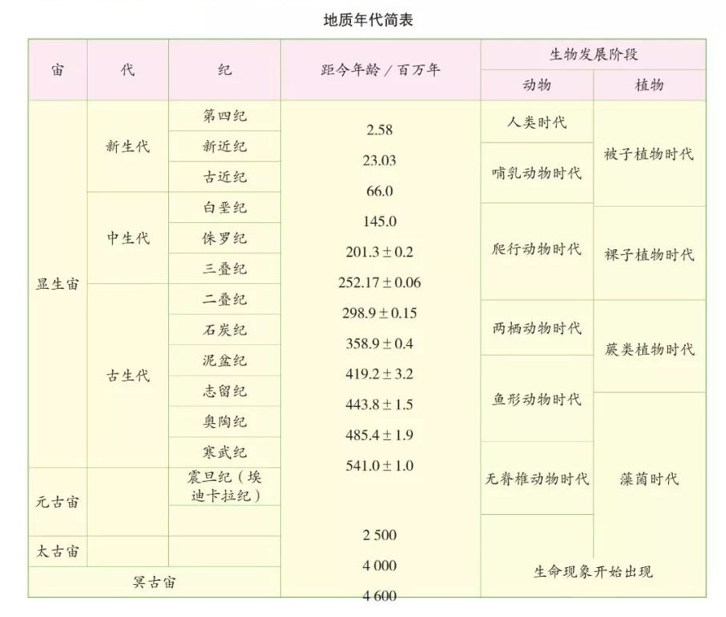
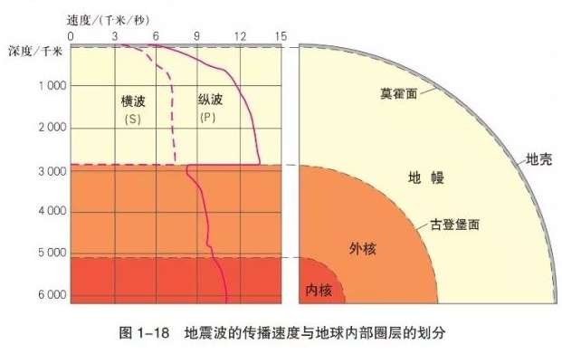

# 地理学考复习

## 太阳圈层

## P33 地质年代简表

地质年代简表

地球气质年代温度变化书P38

地球产生生命的“**<u>金锁链条件</u>**”：液态水、适宜的温度和比较厚的大气层

## 地震波与圈层结构

纵波（S波）快，固液气都传播；横波（P波）速度慢，只能在固体传播

P波是primary wave，S波是secondary wave P波也可以说是压力波pressure wave，S波也可以说是剪力波shear wave

地震波的传播速度：

地壳中氧硅铝铁钙钠钾镁的含量依次最多

上层硅铝层，不连续，密度小；  
下层硅镁层，连续，密度大。

水圈具有连续不规则的特点

## 风成地貌

风蚀作用包括吹蚀作用和磨蚀作用

## 冰川地貌

### 冰川侵蚀地貌

冰川侵蚀地貌包括冰斗、冰川槽谷（U型谷）、角峰、刃脊等

**冰斗**是三面岩壁陡峭，围椅状

**冰川槽谷**是在冰川流动时**刨蚀**作用形成的谷地，两壁陡立谷地开阔  举例：珠穆朗玛峰，西欧阿尔卑斯的勃朗峰

**刃脊**是仅有相邻的两个冰斗不断向内侵蚀，中间形成的一道较为尖锐的山脊

角峰是多个冰斗在同一个地区的多个冰斗一起向中间侵蚀中央剩下的高耸尖锐的岩体

**峡湾**是U型谷地在冰川消融，海平面上升之时被海水淹没形成的，北欧地区非常常见

### 冰川堆积地貌

常见的是冰碛湖、冰斗湖

**冰碛物**是冰川融化时裹挟的物质被放下，无分选性，大小悬殊，分选性很差

冰碛物不断堵塞河道、湖盆，水流不畅，不断汇集，形成**冰斗湖**、**冰碛湖**

## 大气垂直分层

书P73

对流层、平流层、高层大气的分界线分别是12km, 50km, 是在中纬度地区

## 洋流、海盐性质与海洋运动知识扩充：上升流

寒流与暖流对海洋与气候的影响

寒流减温减湿，暖流增温增湿

⭐在同纬度地带，寒流经过的海区盐度偏低，暖流经过的海区盐度偏高

海洋的温度随高度垂直变化是随深度变大，温度变低，深层海水随纬度的温度变化不大

海水盐度深层的地方35不到一点，随纬度较平均

密度是越深越大

上升流  百度百科：

上升流，又名涌升流，是从表层以下沿直线上升的洋流，是由表层流场产生水平辐散所造成。如风吹走表层水，由下面的水上升得以补充。因表层流场的水平辐散，使表层以下的海水铅直上升的流动。相反，因表层流场的水平辐合，使海水由海面铅直下降的流动，称为下降流。上升流和下降流合称为升降流，是海洋环流的重要组成部分。它和水平流动一起构成海洋（总）环流。

上升流通常发生在沿岸地区，是一种垂直向上逆向运动的洋流。由于受风力吹送，将表层海水推离海岸，致使海面略有下降，为达到水压的均衡，深层海水就在这里补偿上升，形成上升流。

海洋底部陆地与矿产资源

## 土壤分层

淋溶层是淋溶作用下物质向下迁移和损失，有机质含量低，色泽较淡

淀积层是土壤物质沉淀、积累的层次

从上到下：有机层、腐殖质层、淋溶层、淀积层、母质层、母岩层

## 地理与化学：天然气的开采利用

而我们日常生活中所说的“天然气”即**狭义上**的天然气含义，是指一种主要由**甲烷**组成的气态化石燃料，它主要存在于油田和天然气田，也有少量出于煤层。

天然气主要由气态低分子烃和非烃气体混合组成，埋藏在地底的深层地质构造之中。一部分天然气与原油储存在同一层，对于这一类的天然气，会随着原油一起被开采出来；同时也有单独存在天然气。目前，我国天然气的主要用途为燃料，可制造炭黑、化学药品以及液化石油气，由天然气生产的丙烷、丁烷是现代工业生产的重要原料。

### 天然气来源

天然气来源于**地下多孔隙岩层中**，包括油田气、气田气、煤层气、泥火山气和生物生成气等，也有少量出于煤层。[原文]([天然气的来源_百度知道](https://zhidao.baidu.com/question/17024072.html#:~:text=%E5%A4%A9%E7%84%B6%E6%B0%94%E6%9D%A5%E6%BA%90%E4%BA%8E%E5%9C%B0%E4%B8%8B%E5%A4%9A%E5%AD%94%E9%9A%99%E5%B2%A9%E5%B1%82%E4%B8%AD%EF%BC%8C%E5%8C%85%E6%8B%AC%E6%B2%B9%E7%94%B0%E6%B0%94%E3%80%81%E6%B0%94%E7%94%B0%E6%B0%94%E3%80%81%E7%85%A4%E5%B1%82%E6%B0%94%E3%80%81%E6%B3%A5%E7%81%AB%E5%B1%B1%E6%B0%94%E5%92%8C%E7%94%9F%E7%89%A9%E7%94%9F%E6%88%90%E6%B0%94%E7%AD%89%EF%BC%8C%E4%B9%9F%E6%9C%89%E5%B0%91%E9%87%8F%E5%87%BA%E4%BA%8E%E7%85%A4%E5%B1%82%E3%80%82,%E5%A4%A9%E7%84%B6%E6%B0%94%E4%B8%BB%E8%A6%81%E7%94%A8%E9%80%94%E6%98%AF%E4%BD%9C%E7%87%83%E6%96%99%EF%BC%8C%E5%8F%AF%E5%88%B6%E9%80%A0%E7%82%AD%E9%BB%91%E3%80%81%E5%8C%96%E5%AD%A6%E8%8D%AF%E5%93%81%E5%92%8C%E6%B6%B2%E5%8C%96%E7%9F%B3%E6%B2%B9%E6%B0%94%EF%BC%8C%E7%94%B1%E5%A4%A9%E7%84%B6%E6%B0%94%E7%94%9F%E4%BA%A7%E7%9A%84%E4%B8%99%E7%83%B7%E3%80%81%E4%B8%81%E7%83%B7%E6%98%AF%E7%8E%B0%E4%BB%A3%E5%B7%A5%E4%B8%9A%E7%9A%84%E9%87%8D%E8%A6%81%E5%8E%9F%E6%96%99%E3%80%82%20%E5%A4%A9%E7%84%B6%E6%B0%94%E4%B8%BB%E8%A6%81%E7%94%B1%E6%B0%94%E6%80%81%E4%BD%8E%E5%88%86%E5%AD%90%E7%83%83%E5%92%8C%E9%9D%9E%E7%83%83%E6%B0%94%E4%BD%93%E6%B7%B7%E5%90%88%E7%BB%84%E6%88%90%E3%80%82))

### 开采天然气的影响

煤、石油的开采，对环境造成了恶劣影响。  

一、对土地的毁坏   
采煤、采油，都要占用、浪费大量的土地资源。  

采煤的矿渣、煤矸石，采油的钻台、设备，占地是自身设备的几十倍，对土地的毁坏是不可逆的。  

二、地下水的破坏  
造成地下水位降低，水质变差，污染。  

三、地面下沉  
山体滑坡、地震的可能性大大增加。地面建筑倒塌的危险大大增加。  

四、能源问题  
煤和石油都是不可再生能源。[原文](https://zhidao.baidu.com/question/15640536.html)
