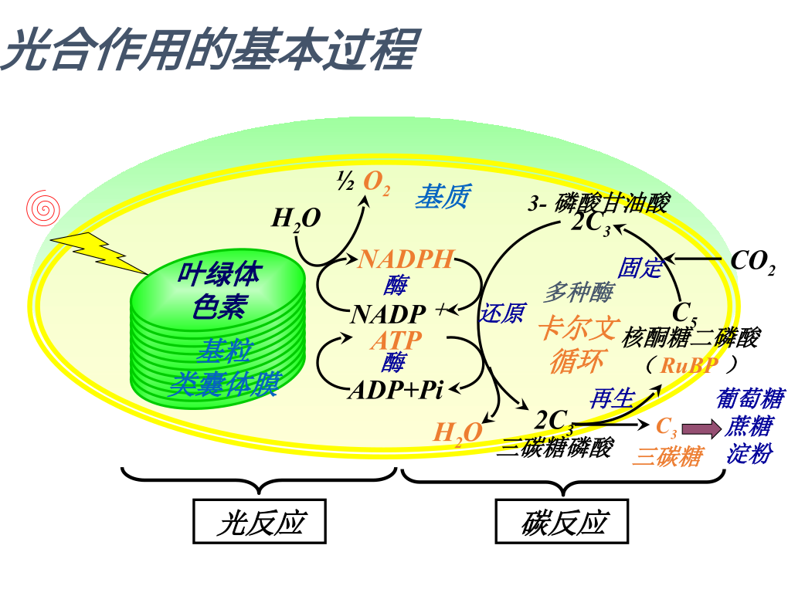
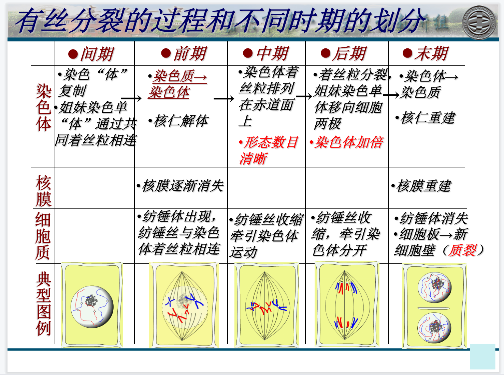
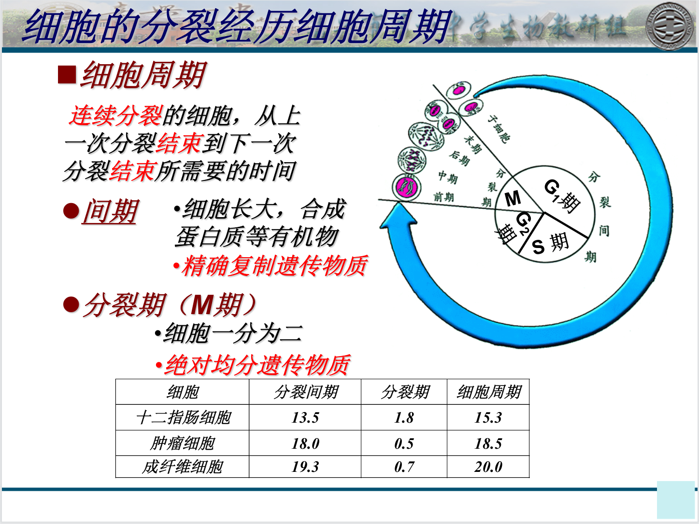
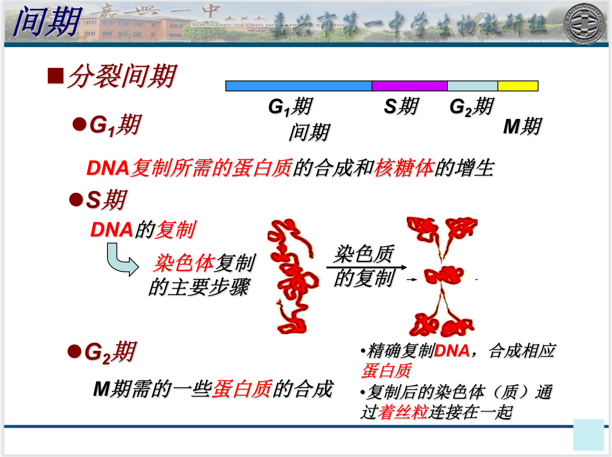
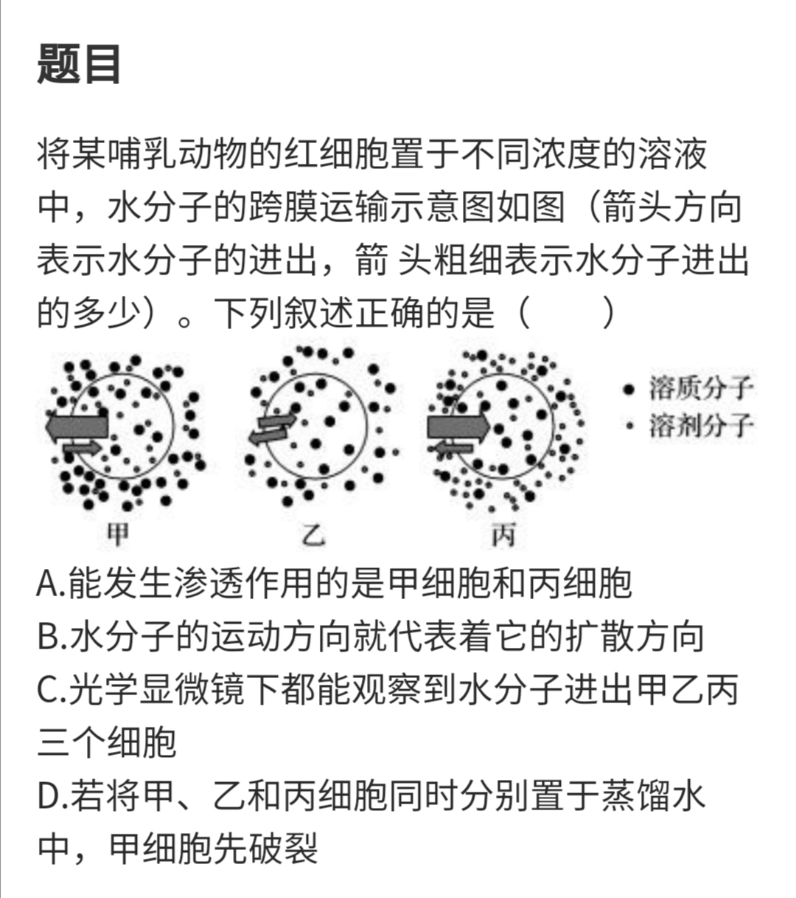

# 生物学考复习

## 细胞呼吸模型图（自制）

## 光合作用模型图

光反应将光能转化为化学能，并释放氧气

碳反应将二氧化碳还原成糖

碳反应过程名称：1. CO2的固定；2. 三碳酸的还原；3. 五碳糖的再生

光反应的场所是类囊体膜；碳反应的场所是叶绿体的基粒

## 光合色素与提取与分离

胡萝卜素扩散快的原因是在层析液中的溶解度大

含量最多的是叶绿素a（色素带最宽）   

叶绿素吸收红光和蓝紫光

类胡萝卜素吸收蓝紫光

## 观察胞质环流实验

取黑藻幼叶的原因是：1. 黑藻幼叶**薄**，1~2层细胞，易于观察；2. 叶绿体**少**，易观察

## 检验糖类、油脂、蛋白质的实验中的注意点

脂肪检测中使用的染液是苏丹III染液，使用的酒精溶液是50%的用来洗去染料

脂肪检测实验只能用作观察脂肪颗粒，溶液里面的脂肪是不能观察，因为这个是个染色，不是反应

三个实验中只有检测还原糖用的本尼迪特试剂需要加热80摄氏度到100摄氏度水浴

检测蛋白质时候用的双缩脲试剂是先加A再加B, A加的多，要加2mL, B加的少只有5滴

## 有关DNA的几个实验

### 活体肺炎链球菌转化实验（格里菲斯）:必修二P49 与 体外肺炎链球菌转化实验（艾弗里）（仍存疑）

S菌和P菌的对比

| 性质   | S菌  | P菌  |
| ---- | --- | --- |
| 菌落表面 | 光滑  | 粗糙  |
| 致病性  | 致病  | 不致病 |
| 荚膜   | 有   | 无   |

活体肺炎链球菌转化实验发现了转化因子的存在并且猜想是DNA，因为加热杀死的S型菌也可以使R型菌转化为S型菌  
活体肺炎链球菌转化实验不能证明DNA是噬菌体的遗传物质

体外肺炎链球菌转化实验这个实验证明了：  
DNA是转化因子（即遗传物质），赋予了生物的遗传特性

### T2噬菌体侵染细菌实验:必修二P51

DNA注入到细菌中，蛋白质外壳留在外面，但是合成了完整的噬菌体

结论是：DNA是遗传物质，蛋白质不是遗传物质

### 在一部分没有DNA的病毒中，RNA是遗传物质：烟草花叶病毒重组实验:必修二P53

单独的RNA可以感染烟草，单独的蛋白质不能感染烟草，用RNA酶处理过的RNA也不能感染烟草

不同病毒株系的RNA和蛋白质混合之后繁殖的病毒类型是提供RNA的株系

实验证明了没有DNA只有RNA的生物的遗传物质是RNA

## 一些容易遗忘的细胞器功能

溶酶体来自高尔基体

动物的高尔基体的功能是**蛋白质**的**加工、分类、包装、运输**；植物的高尔基体的功能是**合成果胶**，与细胞壁的合成与修复有关

光面内质网的功能是**运输蛋白质、合成脂质**（磷脂、胆固醇和类固醇激素）、**解毒**

## 细胞的有丝分裂的周期

## 细胞的物质运输的物质举例

| 转运方式  | 实例               | 方向      | 载体             | 能量             |
| ----- | ---------------- | ------- | -------------- | -------------- |
| 简单扩散  | O2、CO2 甘油、脂溶性维生素 | 高浓度→低浓度 | F              | F              |
| 渗透    | 水、酒精             | 高浓度→低浓度 | F              | F              |
| 易化扩散  | 葡萄糖进入红细胞、某些离子    | 高浓度→低浓度 | <mark>T</mark> | F              |
| 主动转运  | 葡萄糖、氨基酸、离子       | 低浓度→高浓度 | <mark>T</mark> | <mark>T</mark> |
| 胞吞、胞吐 | 蛋白质              | 与浓度无关   | F              | <mark>T</mark> |

## 其他注意点

叶绿体纸层析法提取光合色素中使用的酒精是95%，且这是个溶剂不是层析液，层析液用的是石油醚或乙醚等

检测油脂里面用的是50%酒精来洗去多余的染料细胞膜中

胆固醇：位于脂双层中的疏水环境，有一个很小的亲水基团，与磷脂头部连接。  
作用：双重调节：与磷脂脂肪酸链的相互作用，具有限制其运动、增加其有序性的作用；另一方面，也能将磷脂分子分隔开以增强其运动性。  
作用与温度相关：环境温度较低时，胆固醇有助于保持细胞膜的柔韧性；细胞膜外侧磷脂分子中胆固醇的含量往往高于内侧，因此内侧的磷脂活动性比较弱。 

密码子在<u>**mRNA**</u>上，启动子在<u>**DNA**</u>上，起始密码也在<u>**mRNA**</u>上

使种群基因频率发生变动的因素有：**<u>突变、基因迁移、遗传漂变、非随机交配、自然选择</u>**

## 错题整理

人类的卵细胞可以用肉眼直接看到 （T）

细胞中的遗传物质都是DNA （T）

病毒是非细胞生物，说明细胞不是生命活动的基本单位 （F）

在环境温度较低时，胆固醇有助于保持细胞膜的柔韧性 （T）

蓝细菌没有叶绿体，且可以进行光合作用 （T）

蓝细菌不存在有膜的细胞器，因此不能作为独立的生命单位存在（F）

液泡中的色素使得某些植物的花、叶、果实呈现不同的颜色（T）

细胞液能调节细胞渗透压平衡、酸碱平衡、离子平衡（T）

⭐液泡能合成大量水解酶，能吞噬衰老的细胞器（T）

分泌蛋白质（胰岛素）先在**核糖体**合成，在经过**内质网**加工，随后由**高尔基体**加工，并形成包裹着胰岛素的**囊泡**，转运至细胞膜，并与之融合。

母乳中含丰富的抗体（免疫球蛋白），可以增强婴儿的抵抗力。新生儿小肠上皮细胞通过消耗ATP可以直接吸收母乳中的抗体和半乳糖。这两种物质被吸收到血液中的方式分别是：**胞吞、主动转运**。

解答A

A、渗透作用的条件是半透膜和浓度差,则甲细胞和丙细胞与外界溶液存在浓度差,能发生渗造作用,A正确;

B、水分子既可以由细胞内到细胞外,也可以由细胞外到细胞内,因此水分子的运动方向不代表着它的扩散方向,B错误;

C、光学显微镜无法观察到水分子运输,C错误;

D、将甲、乙和丙细胞同时分别置于蒸馏水中,丙细胞由于开始时吸水膨胀,则放在蒸馏水中先破裂,D错误。

渗透作用的定义：水分子（和其他溶剂分子）通过膜的扩散现象。水分子从低浓度溶液一侧（水的浓度较高）跨膜扩散到高浓度溶液一侧（水的浓度低）   
特点：从高浓度向低浓度一侧运输  不消耗细胞的能源   受外界物质浓度限制 

胞吞体现了细胞膜控制物质进出的功能（F）因为胞吞没有经过细胞膜

丙酮酸先被氧化成乙醛再被还原为乳酸（F）

癌细胞细胞呼吸产生的CO2都来自线粒体（T）因为无氧呼吸如果是乳酸发酵则不产生CO2，所以所有产生的CO2全都来自线粒体的有氧呼吸

若呼吸产物中有水，则一定进行了需氧呼吸（T）

线粒体内膜上存在酶<u>**葡萄糖运载体**</u>等多种蛋白质（F）因为线粒体进行需氧呼吸的第二三阶段，葡萄糖不进入线粒体

丙酮酸产生二氧化碳的过程中可能生成[H]，也可能消耗[H]（T）因为可能是需氧呼吸产生还原氢，也可能是酒精发酵消耗[H]

无氧呼吸产生的乳酸再生成葡萄糖的过程需要消耗能量（T）

蛋白质可以通过核孔进入细胞核（T）

⭐着丝粒的分裂不是纺锤丝的牵引导致的，而是自发发生的，所以“纺锤丝的牵引导致着丝粒分裂”是（F）

⭐基因A与b最本质的差别是：碱基排列顺序不同（这题太鬼了吧）

活体肺炎链球菌转化实验不能证明DNA是噬菌体的遗传物质

高等植物细胞中每个染色体组中都含有常染色体和性染色体（F）因为雌雄同株的植物体内没有性染色体
